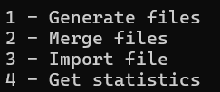

# Used packages
## Microsoft.EntityFrameworkCore
## Npgsql.EntityFrameworkCore.PostgreSQL
## MediatR
## Microsoft.EntityFrameworkCore.Design
## ClosedXML.Excel

# Task 1

Description - menu to working with files

## Task1.1 - Generating files

Description - screenshot of generating files

## Task1.2 - Merging files

Description - screenshot of merging generated files in one file

## Task1.3 - Import data in database

Description - screenshot of importing data

## Task1.4 - Get statistics from database

Description - screenshot of collecting stats from database

# Task 2

Description - menu of interface

## Task2.1 - Uploading data

Description - screenshot of uploading data to the database from excel

## Task2.2 - Viewing the list of uploaded files

Description - screenshot of Viewing the list of uploaded files

## Task2.3 - Displaying data from a DBMS

Description - Displaying data from a DBMS

## Task2.4 - Download data

Description - screenshot of collecting stats from database
